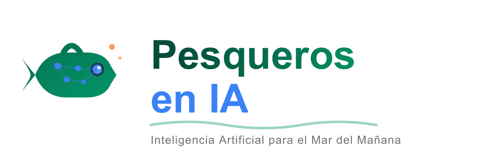
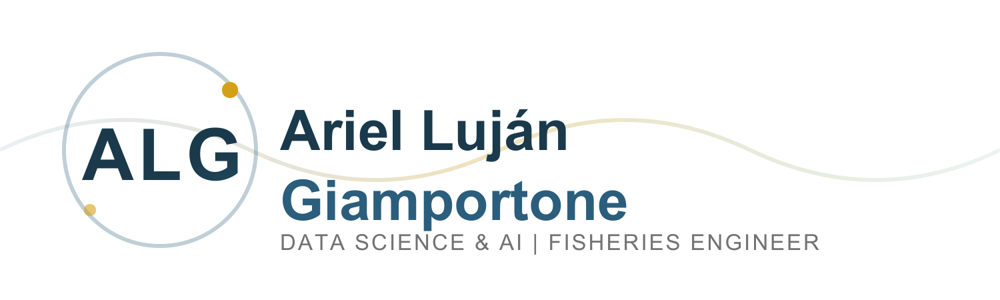

<div align="center">


&nbsp;&nbsp;&nbsp;&nbsp;

&nbsp;&nbsp;&nbsp;&nbsp;


# Inteligencia Artificial Aplicada a la Producción Pesquera

**Curso de extensión universitaria — UTN Facultad Regional Chubut**

[](LICENSE)
[](https://www.python.org/)
[](https://jupyter.org/)
[](https://colab.research.google.com/github/PesquerosEnIA/curso-ia-produccion-pesquera)

</div>

---

## Acerca del curso

Este repositorio contiene el material educativo completo del curso **"Inteligencia Artificial Aplicada a la Producción Pesquera"**, una iniciativa de la comunidad [PesquerosEnIA](https://github.com/PesquerosEnIA) presentada a través de la UTN FRCh.

El curso está orientado a **profesionales del sector pesquero y acuícola argentino** —ingenieros, técnicos, científicos y operadores— que quieran incorporar herramientas de inteligencia artificial y análisis de datos en sus actividades cotidianas.

> *"No se trata de si el sector se va a digitalizar — se trata de si vamos a ser protagonistas o espectadores de esa transformación."*

**10 unidades** · **Modalidad híbrida** · **Agosto 2026 – Mayo 2027** · Sede UTN FRCh, Puerto Madryn · Acceso abierto (GPL-3.0)

**Dirección:** Ing. Cristina Fernández · **Co-Dirección:** Ing. Soraya Corvalán

---

## Programa completo

| # | Clase | Docente(s) | Material |
|---|-------|-----------|----------|
| 1 | Estrategia y Transformación Digital en el Sector Pesquero | Ariel · Soraya · Reussi · Gurisich | [Slides](clase_01_estrategia_transformacion/slides/) · [Guía](clase_01_estrategia_transformacion/guia_pdf/) · **3 niveles 🟢🟡🔴** |
| 2 | Fundamentos de IA y Modelos de Lenguaje (LLMs) | Damian | — |
| 3 | Prompting y Diseño de Asistentes de IA | Damian | — |
| 4 | Datos y Sensores del Dominio Pesquero | Ariel · Soraya | [Slides](clase_04_datos_sensores/slides/) · [Guía](clase_04_datos_sensores/guia_pdf/) · [Notebook](clase_04_datos_sensores/notebooks/) · **3 niveles 🟢🟡🔴** |
| 5 | Arquitectura de Datos y Big Data en Pesca | Damian | — |
| 6 | Machine Learning y Modelos Predictivos | Ariel · Damian | [Notebook](clase_06_ml_modelos_predictivos/notebooks/) · **3 niveles 🟢🟡🔴** |
| 7 | Visión Artificial en Plantas Pesqueras | Damian · Soraya · Dr. González · Errázquin | [Notebook](clase_07_vision_artificial/notebooks/) |
| 8 | Optimización de Operaciones y Agentes de IA | Ariel · Damian | [Notebook](clase_08_optimizacion_agentes/notebooks/) · **3 niveles 🟢🟡🔴** |
| 9 | Visualización y Dashboards para Decisiones | Damian | [Notebook](clase_09_visualizacion_dashboards/notebooks/) |
| 10 | Cierre, Conclusiones y Hoja de Ruta | Soraya · Ariel | [Slides](clase_10_cierre/slides/) · [Guía](clase_10_cierre/guia_pdf/) · **3 niveles 🟢🟡🔴** |

---

## Notebooks disponibles

Todos los notebooks funcionan en **Google Colab sin instalación** — hacé clic en el badge para abrirlos directamente:

| Clase | Notebook | Colab |
|-------|---------|-------|
| 4 · 🟢 Novato | Datos del mar para no programadores | [](https://colab.research.google.com/github/PesquerosEnIA/curso-ia-produccion-pesquera/blob/master/clase_04_datos_sensores/notebooks/clase04_datos_novato.ipynb) |
| 4 · 🟡 Intermedio | Exploración + ejercicios para modificar | [](https://colab.research.google.com/github/PesquerosEnIA/curso-ia-produccion-pesquera/blob/master/clase_04_datos_sensores/notebooks/clase04_datos_intermedio.ipynb) |
| 4 · 🔴 Avanzado | Datos reales, frentes térmicos, feature engineering | [](https://colab.research.google.com/github/PesquerosEnIA/curso-ia-produccion-pesquera/blob/master/clase_04_datos_sensores/notebooks/clase04_datos_avanzado.ipynb) |
| 6 · 🟢🟡🔴 | ML por nivel (novato / intermedio / avanzado) | [🟢](https://colab.research.google.com/github/PesquerosEnIA/curso-ia-produccion-pesquera/blob/master/clase_06_ml_modelos_predictivos/notebooks/clase06_ml_novato.ipynb) · [🟡](https://colab.research.google.com/github/PesquerosEnIA/curso-ia-produccion-pesquera/blob/master/clase_06_ml_modelos_predictivos/notebooks/clase06_ml_intermedio.ipynb) · [🔴](https://colab.research.google.com/github/PesquerosEnIA/curso-ia-produccion-pesquera/blob/master/clase_06_ml_modelos_predictivos/notebooks/clase06_ml_avanzado.ipynb) |
| 7 | Visión artificial y clasificación de calidad en planta | [](https://colab.research.google.com/github/PesquerosEnIA/curso-ia-produccion-pesquera/blob/master/clase_07_vision_artificial/notebooks/clase07_vision_artificial_plantas.ipynb) |
| 8 · 🟢🟡🔴 | Optimización por nivel (novato / intermedio / avanzado) | [🟢](https://colab.research.google.com/github/PesquerosEnIA/curso-ia-produccion-pesquera/blob/master/clase_08_optimizacion_agentes/notebooks/clase08_optimizacion_novato.ipynb) · [🟡](https://colab.research.google.com/github/PesquerosEnIA/curso-ia-produccion-pesquera/blob/master/clase_08_optimizacion_agentes/notebooks/clase08_optimizacion_intermedio.ipynb) · [🔴](https://colab.research.google.com/github/PesquerosEnIA/curso-ia-produccion-pesquera/blob/master/clase_08_optimizacion_agentes/notebooks/clase08_optimizacion_avanzado.ipynb) |
| 9 | Dashboard operativo de flota pesquera | [](https://colab.research.google.com/github/PesquerosEnIA/curso-ia-produccion-pesquera/blob/master/clase_09_visualizacion_dashboards/notebooks/clase09_dashboard_pesquero.ipynb) |

---

## Requisitos

```bash
pip install pandas numpy matplotlib seaborn scikit-learn jupyter
# Opcionales para Clase 9:
pip install plotly folium
```

Todos los datos utilizados son **abiertos y públicos**:
[INIDEP](http://www.inidep.edu.ar) · [Copernicus Marine](https://marine.copernicus.eu) · [NOAA](https://www.noaa.gov) · [Global Fishing Watch](https://globalfishingwatch.org)

---

## Equipo docente

**Dirección:** Ing. Cristina Fernández  ·  **Co-Dirección:** Ing. Soraya Corvalán

<table>
<tr>
<td width="25%" align="center">
<b>Ariel Giamportone</b><br/>
<sub>Ing. Pesquero UTN FRCh<br/>Data Science & IA<br/>MBA Log. y Operaciones<br/>Intervalor Data, Madrid<br/><a href="https://github.com/arielgiamportone">@arielgiamportone</a></sub>
</td>
<td width="25%" align="center">
<b>Soraya Corvalán</b><br/>
<sub>Ing. Pesquera<br/>Ex-INIDEP · FAO TCP/ARG/4001D<br/>Pampa Azul · REDPAN<br/>Profesora Asociada UTN FRCh<br/>1ª graduada Ing. Pesquera ARG</sub>
</td>
<td width="25%" align="center">
<b>Damian Adolfo Giacone</b><br/>
<sub>Lic. Sistemas<br/>Máster Industria 4.0 (IEBS)<br/>Docente UGR · Legal-Hub<br/>Ex-Alpesca S.A.</sub>
</td>
<td width="25%" align="center">
<b>Dr. Juan D. González</b><br/>
<sub>Dr. Matemática Aplicada (UBA)<br/>SENASA IA · CONICET/DIIV-ARA<br/>Docente UBA + UNGBrown<br/>paquetes RMBC + ktaucenters en CRAN</sub>
</td>
</tr>
</table>

<sub>**Docentes adicionales del programa** (bios en actualización): **María Ana Reussi** y **Soledad Gurisich** (Unidad 1) · **Martín I. Errázquin** (Unidad 7).</sub>

---

## Antecedentes

| Año | Evento | Descripción |
|-----|--------|-------------|
| 2019 | I CONIPE — Puerto Madryn | Minicurso Industria 4.0 (8 horas) + mesa redonda de IA en pesca |
| 2025 | CONIPE 2025 — Puerto Madryn | Curso de alfabetización en IA (8 módulos) para el sector pesquero |
| 2026–2027 | Este curso — UTN FRCh | 10 unidades de formación aplicada en IA para el sector pesquero (Ago 2026 – May 2027) |

---

## Licencia

Material de acceso abierto bajo licencia [GPL-3.0](LICENSE), consistente con los demás proyectos de la comunidad PesquerosEnIA.

<div align="center">

**[PesquerosEnIA](https://github.com/PesquerosEnIA) · UTN FRCh · 2026**

*IA para el sector pesquero, desde el sector pesquero.*

</div>
